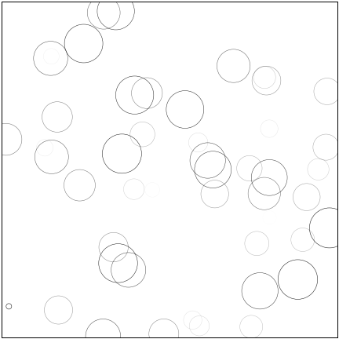

# Data Visualization

### SOURCES

[]()
[]()
[]()

#### ARTICLES
[Matplotlib Tutorial](https://github.com/rougier/matplotlib-tutorial)
[]()
[]()

## NOTES

- matplotlib has probably the worst name of any package Ive ever seen and that includes mongo. Seriously who came up with this?
- ajksfjh is the most used 2d graphics package on python
- This mixes 2 of my least favorite things, advanced math and python GREAT!
- I was unaware you could do animations with python. There is an example of a "rain drop" using math to generate the circles. Why does something so cool looking have to be made in the worst way possible?

- unfortunately the code behind this is very difficult to understand. This is pulled directly from the github: 

```
# Number of ring
n = 50
size_min = 50
size_max = 50*50

# Ring position
P = np.random.uniform(0,1,(n,2))

# Ring colors
C = np.ones((n,4)) * (0,0,0,1)
# Alpha color channel goes from 0 (transparent) to 1 (opaque)
C[:,3] = np.linspace(0,1,n)

# Ring sizes
S = np.linspace(size_min, size_max, n)

# Scatter plot
scat = ax.scatter(P[:,0], P[:,1], s=S, lw = 0.5,
                  edgecolors = C, facecolors='None')

# Ensure limits are [0,1] and remove ticks
ax.set_xlim(0,1), ax.set_xticks([])
ax.set_ylim(0,1), ax.set_yticks([])

```
and 

```
def update(frame):
    global P, C, S

    # Every ring is made more transparent
    C[:,3] = np.maximum(0, C[:,3] - 1.0/n)

    # Each ring is made larger
    S += (size_max - size_min) / n

    # Reset ring specific ring (relative to frame number)
    i = frame % 50
    P[i] = np.random.uniform(0,1,2)
    S[i] = size_min
    C[i,3] = 1

    # Update scatter object
    scat.set_edgecolors(C)
    scat.set_sizes(S)
    scat.set_offsets(P)

    # Return the modified object
    return scat,

```

This code is nice because while I dont know what its doing just by looking at the code itself, it is commented on very well and makes understanding it very eazy. 
- this is clearly a powerful tooll for people involved in data science or science in general. The ability to have such control over the data and to be able to visualize it seems invaluable.
