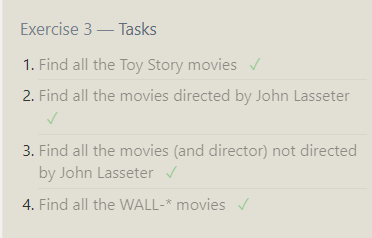

# SQL Assignment Notes

## Screenshots-

## Notes-

- SQL was much easier to read and understand than normal languages like JS. The ability to be able to read it like regualar english makes it much easier for new people like myself. From what I see so far I like sql more than mongodb/js. 

- The way sql databases are set up also seems much easier to manage, esspecially at larger scale like thered be in bigger corporations. 

- The ability to draw info from multiple databases at once is also very useful and I think will make organization much easier.